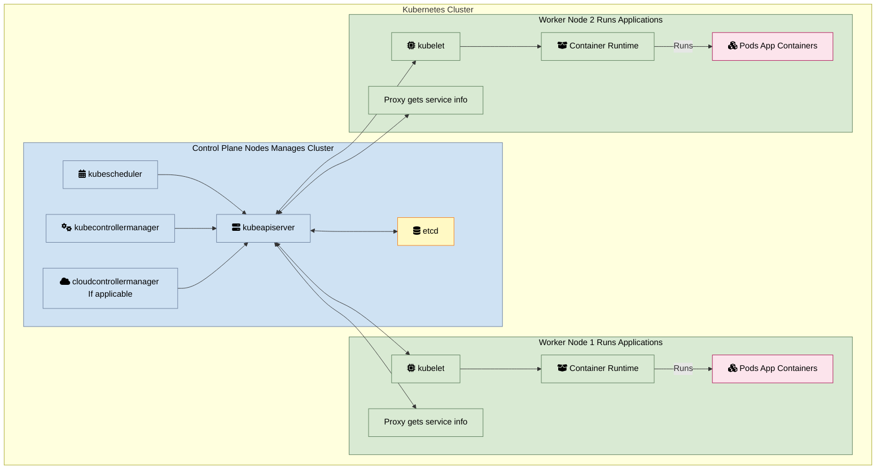

```mermaid
graph TD
    subgraph KubernetesCluster [Kubernetes Cluster]
        direction LR

        subgraph ControlPlaneNode [Control Plane Nodes Manages Cluster]
            direction TB
            cp_api[fa:fa-server kubeapiserver]:::cp
            cp_etcd[fa:fa-database etcd]:::cp_etcd
            cp_sched[fa:fa-calendar-alt kubescheduler]:::cp
            cp_kcm[fa:fa-cogs kubecontrollermanager]:::cp
            cp_ccm[fa:fa-cloud cloudcontrollermanager If applicable]:::cp

            %% Internal Control Plane communication primarily via API Server
            cp_api <--> cp_etcd
            cp_sched --> cp_api
            cp_kcm --> cp_api
            cp_ccm --> cp_api
        end

        subgraph WorkerNode1 [Worker Node 1 Runs Applications]
             direction TB
             wn1_let[fa:fa-microchip kubelet]:::wn
             wn1_proxy[fa:fa-network-wired kubeproxy]:::wn
             wn1_runtime[fa:fa-box-open Container Runtime]:::wn
             wn1_pods[fa:fa-cubes Pods App Containers]:::pod

             %% Worker Node internal operation
             wn1_let --> wn1_runtime
             wn1_runtime -- Runs --> wn1_pods
        end

         subgraph WorkerNode2 [Worker Node 2 Runs Applications]
             direction TB
             wn2_let[fa:fa-microchip kubelet]:::wn
             wn2_proxy[fa:fa-network-wired kubeproxy]:::wn
             wn2_runtime[fa:fa-box-open Container Runtime]:::wn
             wn2_pods[fa:fa-cubes Pods App Containers]:::pod

             %% Worker Node internal operation
             wn2_let --> wn2_runtime
             wn2_runtime -- Runs --> wn2_pods
        end

        %% Communication between Control Plane and Worker Nodes
        cp_api <--> wn1_let
        cp_api <--> wn2_let
        cp_api <--> wn1_proxy[Proxy gets service info]
        cp_api <--> wn2_proxy[Proxy gets service info]

    end

    %% Styling
    classDef cp fill:#cfe2f3,stroke:#6b7f9d,color:black;
    classDef cp_etcd fill:#fff9c4,stroke:#f57f17,color:black;
    classDef wn fill:#d9ead3,stroke:#5a7d5a,color:black;
    classDef pod fill:#fce4ec,stroke:#ad1457,color:black;

    class ControlPlaneNode,cp_api,cp_sched,cp_kcm,cp_ccm cp;
    class cp_etcd cp_etcd;
    class WorkerNode1,WorkerNode2,wn1_let,wn1_proxy,wn1_runtime,wn2_let,wn2_proxy,wn2_runtime wn;
    class wn1_pods,wn2_pods pod;
```